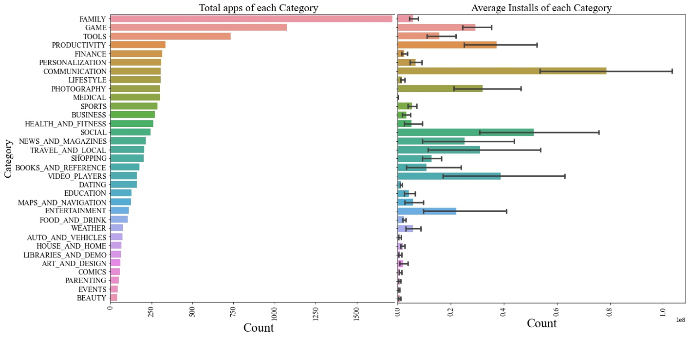
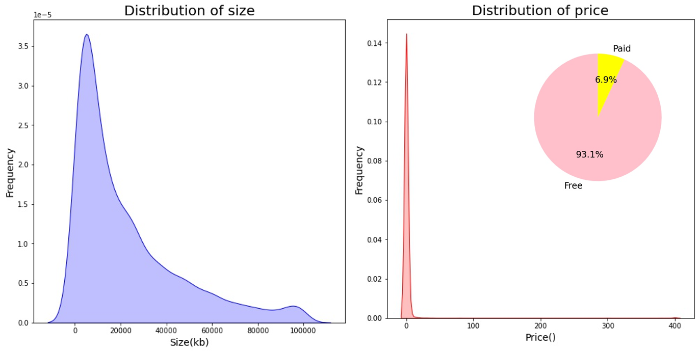
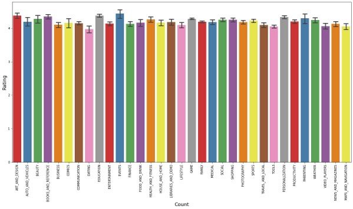
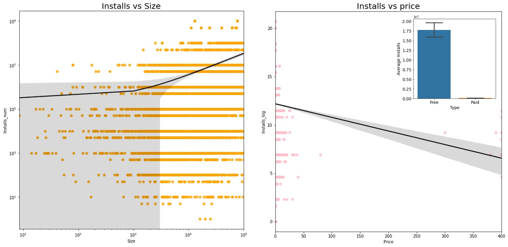
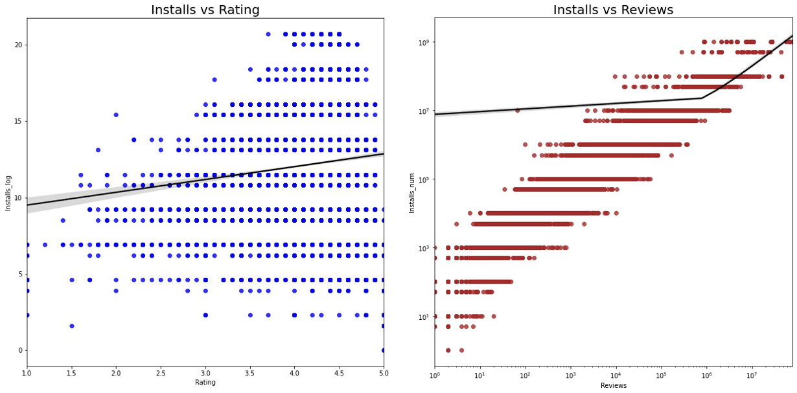

## Googleplay Store Apps Analysis 

### Intrduction

In this project, I performed data analysis on Googleplay Store Apps dataset in two ways and presented in three types of presentations:

**1. [Tableau Dashboard](https://public.tableau.com/profile/xiangning.bu#!/vizhome/GoogleappsEDA/Story1 "Tableau Public")**

**2. Python based data visualization**

### Insights 

1. Although there are more  apps belongs to game and family categories, Communication apps have the highest average installs 

2. Majority of the apps size are less than 40M.Most of the apps are free for best price strategy

3. It looks all average ratings are above 4 across all categories

4. As installs increase, the size increases as well. However, paid or more expensive apps  leads to less installs

5. As installs increase, the apps get better ratings.  Reviews count dramatically increased along with installs

